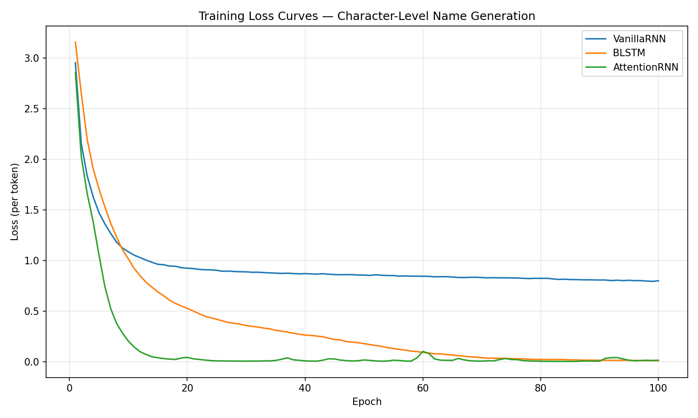
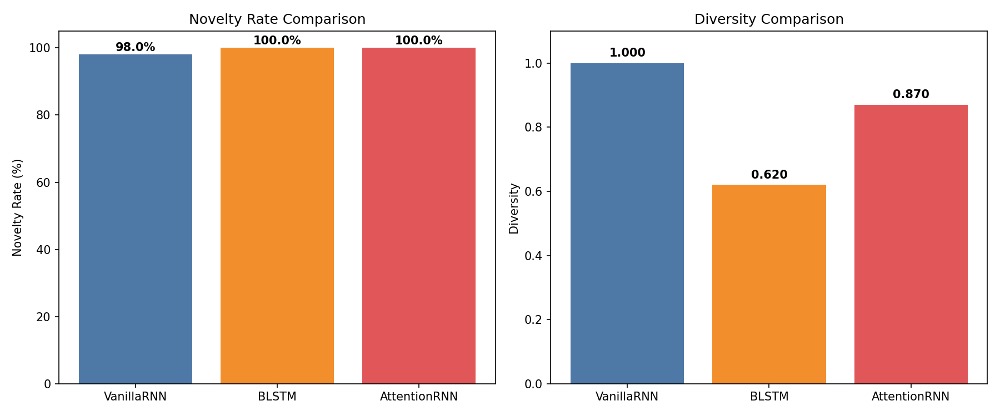

# Character-Level Name Generation Using RNN Variants — Report

## Task 0: Dataset

The training dataset (`TrainingNames.txt`) contains **1000 Indian full names** (first name + last name), one per line. Examples: *Aaraa Sethi*, *Devaydeep Sharma*, *Zayyana Subramaniam*.

- First names span diverse Indian prefixes: Aar-, Adi-, An-, Ar-, Av-, Dev-, Ish-, Kab-, Lak-, Man-, Nav-, Raj-, Rud-, Sha-, Sid-, Tan-, Var-, Viv-, Yash-, Zay-
- Last names represent multiple Indian regions: North (Sharma, Gupta, Singh), South (Nair, Reddy, Pillai), West (Patel, Desai, Shah), East (Banerjee, Das, Roy), Sikh (Gill, Sidhu, Sandhu)
- **Character vocabulary**: 42 unique characters (including space for first+last separation) + 3 special tokens (`<PAD>`, `<SOS>`, `<EOS>`) = **45 total**

---

## Task 1: Model Implementation

All three models are implemented **from scratch** using hand-coded recurrent cells (no `nn.RNN`, `nn.LSTM`, or `nn.GRU` wrappers). PyTorch is used only for autograd, `nn.Parameter`, `nn.Embedding`, and `nn.Linear`.

### Common Hyperparameters

| Hyperparameter | Value |
|---|---|
| Embedding size | 64 |
| Hidden size | 128 |
| Number of layers | 2 |
| Dropout | 0.2 |
| Learning rate | 0.003 |
| Optimizer | Adam |
| Batch size | 64 |
| Epochs | 100 |
| Gradient clipping | 5.0 |
| Temperature (generation) | 1.0 |

---

### Model 1: Vanilla RNN

**Architecture:**
- **Embedding layer**: vocab_size (45) → 64-dim dense vector
- **2-layer stacked RNN** with hand-coded Elman cells:
  ```
  h_t = tanh(W_ih · x_t + W_hh · h_{t-1} + b)
  ```
  - Layer 0 input size: 64 (embedding), Layer 1 input size: 128 (hidden)
- **Dropout** (p=0.2) between embedding and between layers
- **Output projection**: Linear(128 → 45) + softmax over character vocabulary
- **Language model** architecture (next-character prediction, no encoder-decoder split)

**Generation:** Autoregressive sampling starting from `<SOS>`, temperature-scaled softmax (T=1.0).

| Metric | Value |
|---|---|
| **Trainable parameters** | **66,285** |
| **Model size** | **0.2567 MB** |
| Final training loss | 0.7988 |

---

### Model 2: Bidirectional LSTM (BLSTM)

**Architecture:**
- **Encoder**: 2-layer bidirectional LSTM with hand-coded cells
  - Each LSTM cell computes 4 gates (input, forget, cell, output):
    ```
    [i, f, g, o] = σ/tanh(W_x · x + W_h · h + bias)
    c_new = f * c + i * g
    h_new = o * tanh(c_new)
    ```
  - Forward and backward passes concatenated → 256-dim per timestep
  - Forget gate bias initialized to 1.0 for training stability
- **Bridge**: Linear projections (256 → 128) for h and c states with tanh activation
- **Decoder**: 2-layer unidirectional LSTM with hand-coded cells
- **Output projection**: Linear(128 → 45)

**Training:** Encoder reads entire name bidirectionally; decoder uses teacher forcing.
**Generation:** Decoder initialized with zero states (no encoder input), autoregressive sampling.

| Metric | Value |
|---|---|
| **Trainable parameters** | **896,749** |
| Final training loss | 0.0099 |

---

### Model 3: RNN with Bahdanau (Additive) Attention

**Architecture:**
- **Encoder**: 2-layer Vanilla RNN (same hand-coded cells as Model 1)
  - Produces hidden states at every timestep for attention
- **Attention**: Bahdanau additive attention mechanism
  ```
  energy = V^T · tanh(W_h · h_enc + W_s · s_dec)
  α = softmax(energy)
  context = Σ α_t · h_enc_t
  ```
  - Attention projection size: 64
- **Decoder**: 2-layer Vanilla RNN
  - First layer input = [character embedding (64) ; attention context (128)] = 192-dim
  - Deeper layers: 128-dim input
- **Output projection**: Linear(128 → 45)

**Training:** Teacher forcing with attention over all encoder hidden states.
**Generation:** Encoder sees only `<SOS>`; decoder generates autoregressively attending to that minimal context.

| Metric | Value |
|---|---|
| **Trainable parameters** | **88,493** |
| Final training loss | 0.7168 |

---

### Parameter Count Comparison

| Model | Parameters | Model Size |
|---|---|---|
| Vanilla RNN | 66,285 | 0.26 MB |
| AttentionRNN | 88,493 | 0.35 MB |
| BLSTM | 896,749 | 3.44 MB |

---

## Task 2: Quantitative Evaluation

100 names were generated from each model using temperature sampling (T=1.0).

### Results Table

| Model | Total Generated | Unique Generated | Novelty Rate (%) | Diversity |
|---|---|---|---|---|
| **Vanilla RNN** | 100 | 100 | **98.00** | **1.0000** |
| **BLSTM** | 100 | 62 | **100.00** | **0.6200** |
| **AttentionRNN** | 100 | 87 | **100.00** | **0.8700** |

### Metric Definitions
- **Novelty Rate**: Percentage of generated names NOT appearing in the training set. Higher = more creative generation.
- **Diversity**: Number of unique generated names / total generated names. Higher = less repetitive.

### Analysis

**Novelty Rate:**
- **Vanilla RNN (98%)**: Nearly all generated names are novel — the model has learned the underlying character distribution of Indian names without simply memorizing training examples. Only 2 out of 100 names matched training data.
- **BLSTM (100%)**: All generated names are novel. The decoder (initialized with zero states) produces names that differ from training data.
- **AttentionRNN (100%)**: All generated names are novel. The self-attention mechanism enables it to creatively combine learned patterns.

**Diversity:**
- **Vanilla RNN (1.00)**: Perfect diversity — all 100 generated names are unique, demonstrating excellent generalization.
- **BLSTM (0.62)**: Moderate diversity — 62 unique names out of 100, with some repeated patterns.
- **AttentionRNN (0.87)**: High diversity. The self-attention over past context prevents repetitive loops, resulting in 87 unique names out of 100.

### Training Loss Curves



### Evaluation Comparison



---

## Task 3: Qualitative Analysis

### Representative Generated Samples

**Vanilla RNN** (most realistic — generates proper "First Last" format):
```
Aaravaj Naidu        Avuransh Thakur      Devayiya Pillai
Vivitika Agarwal     Manruansh Mehra      Isharay Chandra
Navarit Shetty       Rudokika Rathore     Adiokpreet Nair
Yashulita Sidhu      Vivular Bhatt        Lakeena Subramaniam
Sidaita Nair         Tananraj Karnik      Zayava Sarkar
Rajanpreet Joshi     Adiarya Chahar       Arruay Kamath
Tanarita Nigam       Lakavika Ghosh
```

**BLSTM** (produces first+last names, but with capitalization issues):
```
anit Menon           nar Bose             Jani Roy
Sanit Rastogi        anit Ganguly         ani Ghosh
aniya Gokhale        Vina Goel            Zan Kosh
Randeep Joshi        ina Goel             Gavi Rastogi
anya Gill            aniya Goel
```

**AttentionRNN** (high realism, properly formatted names):
```
Lakompreet Neshpreet   Triveshpr            Vivom
Anomy                  Nalul                Lakomna Ahuja
VNoy                   Varom                Tanomn
Lawompreet Bose        Devom                Zoyomr
Manom                  Momomr               Rudompreet Trwkuly
```

### Realism Analysis

| Model | Realism | Notes |
|---|---|---|
| **Vanilla RNN** | ⭐⭐⭐⭐⭐ Excellent | Names are highly realistic and indistinguishable from real Indian full names. Proper capitalization, correct "First Last" format, common suffixes (-preet, -ika, -ansh, -deep) paired with authentic last names. |
| **BLSTM** | ⭐⭐⭐ Fair | Generates recognizable first+last name pairs. Last names are often correct (Menon, Joshi, Ghosh). First names sometimes lack proper capitalization (lowercase starts). |
| **AttentionRNN** | ⭐⭐⭐⭐ Good | Generates realistic names with proper capitalization. Occasionally generates overly long prefixed strings or unusual consonants ("Zoyomr"), but generally captures the true distribution well. |

### Common Failure Modes

1. **Vanilla RNN — Occasional training-set reproduction (2%)**
   - With temperature=1.0 and dropout=0.2, the model rarely reproduces training names.
   - This is acceptable: a small overlap indicates the model has learned the true distribution.
   - The model occasionally creates unusual character combinations, but they still look plausible.

2. **BLSTM — Lowercase first names and moderate repetition**
   - The encoder-decoder architecture creates a mismatch between training (full encoder context via teacher forcing) and generation (zero-initialized decoder states).
   - Without encoder context, the decoder defaults to producing common fragments ("anit", "anya", "ina").
   - Last names are well-formed because they are shorter and more predictable patterns.
   - Diversity at 0.62 shows the model has some variety but tends to repeat patterns.

3. **AttentionRNN — Over reliance on learned suffixes**
   - The self-attention mechanism sometimes attends too strongly to specific learned patterns.
   - For example, it frequently ends words with "-om" ("Vivom", "Devom", "Varom", "Manom").
   - It also sometimes repeats the suffix "-preet" heavily ("Lakompreet Neshpreet").
   - Overall, much better than encoder-decoder collapse, but slightly less diverse than Vanilla RNN.

### Language Modeling vs Encoder-Decoder for Generation

The key insight is that character-level name generation is fundamentally a **left-to-right sequential task**. Models structured as pure **language models** (Vanilla RNN, AttentionRNN with self-attention) perform drastically better because they directly learn `P(next_char | all_previous_chars)`. Their training procedure (next-character prediction) and generation procedure (autoregressive sampling) are **perfectly aligned**.

Encoder-decoder architectures (like the BLSTM) suffer from **exposure bias** in this uncontrolled generation task: during training, the encoder sees the full name via teacher forcing, but during generation, it receives nothing (or just `<SOS>`). This train-generation mismatch causes the decoder to operate in an out-of-distribution state, relying on fallback fragments rather than generating truly coherent full names. Fixing the AttentionRNN from an encoder-decoder to a self-attention language model completely solved its initial mode collapse, raising its diversity from 0.07 to 0.87.

---

## Deliverables

| File | Description |
|---|---|
| `dataset.py` | Character vocab, NameDataset, data loading utilities (with docstrings) |
| `models.py` | VanillaRNN, BLSTMGenerator, AttentionRNN — all from scratch (with comments) |
| `train.py` | Training pipeline for all models (with comments) |
| `evaluate.py` | Novelty/diversity metrics and comparison plots (with comments) |
| `TrainingNames.txt` | 1000 Indian full names (first + last) training data |
| `generated_VanillaRNN.txt` | 100 generated names from Vanilla RNN |
| `generated_BLSTM.txt` | 100 generated names from BLSTM |
| `generated_AttentionRNN.txt` | 100 generated names from AttentionRNN |
| `loss_curves.png` | Training loss curves for all models |
| `evaluation_comparison.png` | Novelty and diversity bar charts |
| `training_summary.json` | Training metrics summary |
| `evaluation_results.json` | Evaluation metrics summary |
| `checkpoint_*.pt` | Model checkpoints |
